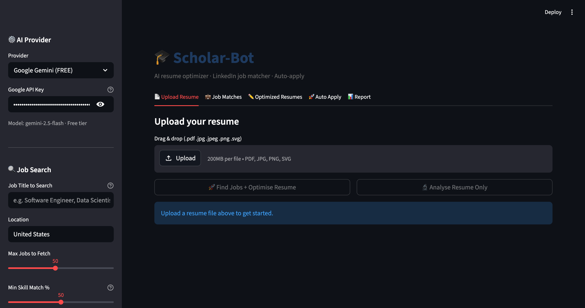
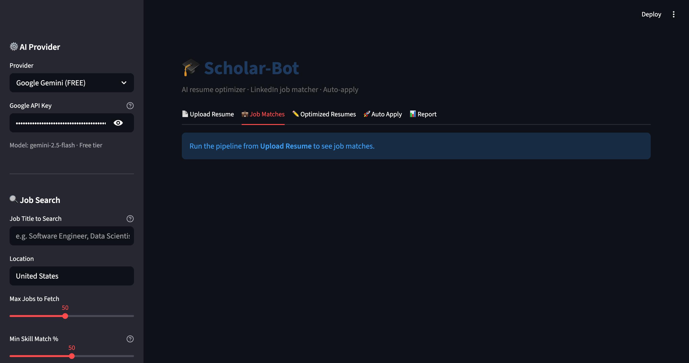
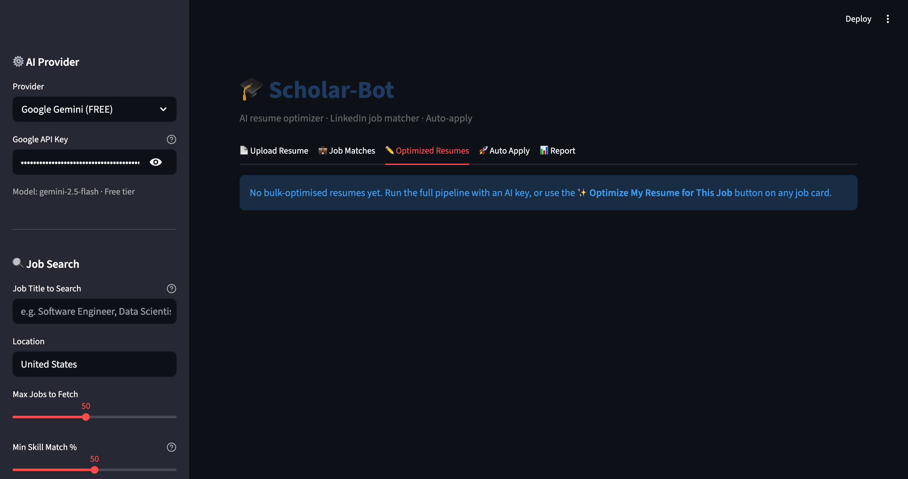
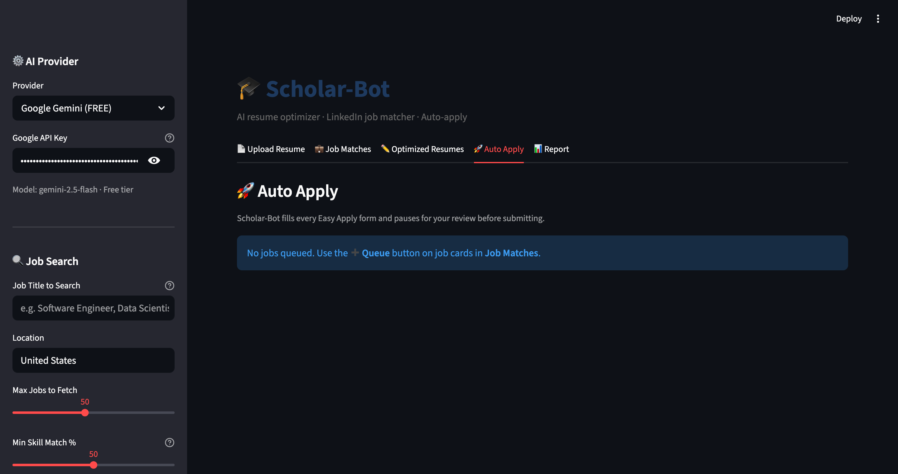
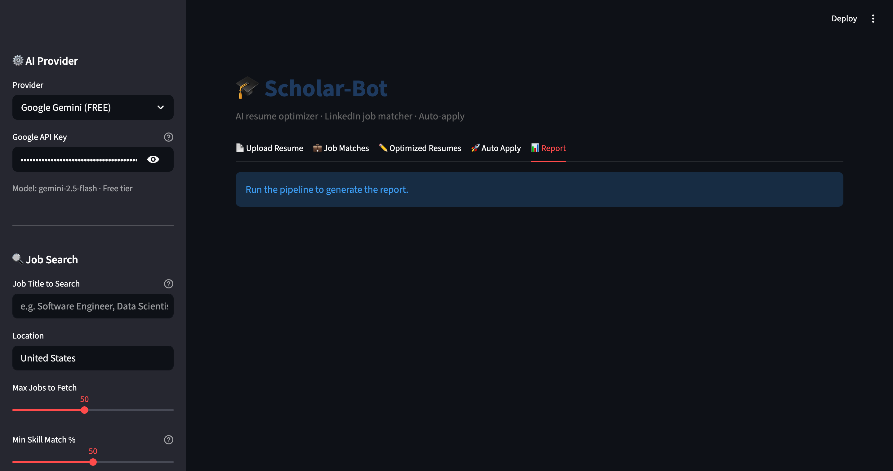

# 🎓 Scholar-Bot

> **AI-powered resume optimizer, LinkedIn job matcher, and auto-apply agent.**
>
> Upload your resume → AI extracts your skills → scrapes LinkedIn for matching jobs → rewrites your resume for each job's ATS → pre-fills every Easy Apply form → you proof-read → one click submits.

---

## ⚡ Quick Start (3 commands)

```bash
git clone https://github.com/Singhniku/scholar-bot.git
cd scholar-bot
./setup.sh
```

The `setup.sh` script:
- Creates a Python virtual environment (`.venv`)
- Installs all dependencies
- Offers to install Tesseract OCR (macOS via Homebrew)
- Creates `.env` from `.env.example`
- Prepares `output/` and `uploads/` folders

Then add your free Gemini API key to `.env` and start the app:

```bash
source .venv/bin/activate
streamlit run app.py
```

Open **http://localhost:8501** — done.

> 🔑 **Get a free Gemini key** at [aistudio.google.com/apikey](https://aistudio.google.com/apikey) — takes 30 seconds, no credit card.
> The free tier handles ~1500 requests/day which is plenty for personal use.

---

## 🚀 What it does

| Tab | What it does |
|-----|-------------|
| 📄 **Upload Resume** | Parse PDF/JPG/PNG/SVG → extract skills → run ATS audit |
| 💼 **Job Matches** | Browse LinkedIn jobs ranked by match score + recency |
| ✏️ **Optimised Resumes** | Download ATS-tailored PDF / Markdown per job |
| 🚀 **Auto Apply** | Bot fills LinkedIn Easy Apply → you review → submit |
| 📊 **Report** | Full ranked table, score chart, CSV export |

---

## 📸 Screenshots

### Upload Resume — drag & drop, configure search in sidebar


### Job Matches — ranked LinkedIn jobs with match score, expandable description, optimise per-job


### Optimised Resumes — full preview with before/after ATS score, PDF + Markdown download


### Auto Apply — Selenium fills the form, pauses, you approve before submit


### Report — ranked table, score chart, CSV export


---

## ✨ Features

- **Multi-format resume parsing** — PDF (native + OCR fallback), JPG, JPEG, PNG, SVG
- **Dual AI provider** — Google Gemini (free, default) or Anthropic Claude (paid)
- **Keyword-only fallback mode** — fully usable when AI quota is exhausted
- **LinkedIn job scraping** — searches public LinkedIn Jobs without an account
- **Job-title search + match-% filter** — only shows jobs ≥ your chosen threshold
- **ATS audit** — 7-rule keyword score + AI-powered bullet rewrites and gap analysis
- **Resume optimisation** — bullets rewritten to mirror each job's exact keywords (no fabrication)
- **Before/after ATS score** — see exactly how much the optimisation improved your score
- **Auto Apply with human gate** — Selenium fills every form, pauses for your approval, only submits on click
- **PDF + Markdown output** — single-column ATS-safe formatting, no images, no tables

---

## 📋 Prerequisites

| Requirement | Minimum | Required for |
|-------------|---------|--------------|
| Python | 3.10+ | Everything |
| Google Chrome | Recent | Auto Apply only |
| Tesseract OCR | 4.x+ | Image / SVG resume parsing only — PDFs work without it |

`./setup.sh` checks all of these and offers to install Tesseract on macOS.

### API keys

- **Google Gemini** (recommended, free) — [aistudio.google.com/apikey](https://aistudio.google.com/apikey)
- **Anthropic Claude** (optional, paid) — [console.anthropic.com](https://console.anthropic.com)

Set in `.env`:

```dotenv
AI_PROVIDER=gemini                    # or "anthropic"
GOOGLE_API_KEY=AIza...                # required for AI mode
ANTHROPIC_API_KEY=                    # only if AI_PROVIDER=anthropic

# Optional — only needed for Auto Apply
LINKEDIN_EMAIL=you@example.com
LINKEDIN_PASSWORD=yourpassword
```

> Without an AI key the app still works in **keyword mode** — jobs are still fetched, scored, and you can download a basic optimised resume.

---

## 🔧 Manual setup (alternative to `setup.sh`)

```bash
git clone https://github.com/Singhniku/scholar-bot.git
cd scholar-bot
python3 -m venv .venv
source .venv/bin/activate                 # Linux/macOS
# .venv\Scripts\Activate.ps1              # Windows PowerShell
pip install -r requirements.txt
cp .env.example .env                       # then edit .env
streamlit run app.py
```

Tesseract by platform:

```bash
# macOS
brew install tesseract
# Ubuntu / Debian
sudo apt install tesseract-ocr
# Windows: download installer from https://github.com/UB-Mannheim/tesseract/wiki
```

---

## 🏗️ Architecture

```
Resume file (PDF/JPG/PNG/SVG)
    │
    ▼
ResumeParser              ← pdfplumber / pytesseract / cairosvg
    │ raw text
    ▼
SkillsExtractor           ← Gemini or Claude  (fallback: regex parser)
    │ structured JSON {skills, experience, education …}
    ▼
LinkedInScraper           ← requests + BeautifulSoup
    │ job dicts {title, company, date, description, url}
    ▼
score_match               ← keyword overlap + ATS keyword scoring
    │ {match_score, matched, missing}
    ▼
ATSOptimizer              ← Gemini or Claude (per job)
    │ rewritten resume JSON
    ▼
ResumeGenerator           ← reportlab PDF + Markdown
    │ files
    ▼
AutoApply                 ← Selenium (Easy Apply forms)
    │ pre-filled form + screenshot
    ▼
Human review (Streamlit)  ─→ Submit / Skip
```

---

## 📁 Project Structure

```
scholar-bot/
├── app.py                    Streamlit web UI — 5 tabs, full pipeline
├── main.py                   CLI entry point (alternative to UI)
├── config.py                 Environment-based configuration
├── setup.sh                  One-command setup script
├── test_e2e.py               End-to-end test suite
├── requirements.txt          All Python dependencies
├── .env.example              Config template — copy to .env
│
├── src/
│   ├── ai_client.py          Unified Gemini/Anthropic client
│   ├── resume_parser.py      PDF / image / SVG → text
│   ├── skills_extractor.py   AI: structured skill extraction + scoring
│   ├── fallback_extractor.py Regex-based extraction (no AI)
│   ├── linkedin_scraper.py   LinkedIn public-jobs scraper
│   ├── ats_optimizer.py      AI: rewrite resume per job
│   ├── resume_generator.py   reportlab PDF + Markdown
│   └── auto_apply.py         Selenium Easy Apply bot
│
├── skills/                   Reusable test fixtures + 50+ unit tests
└── output/  uploads/         Generated files (gitignored)
```

---

## 🧪 Testing

```bash
source .venv/bin/activate

# Full unit test suite (mocked AI — no network, no API key needed)
pytest skills/ -v

# End-to-end live test (uses your real API key + LinkedIn)
python test_e2e.py
```

`test_e2e.py` runs all 9 scenarios: fallback extraction, AI extraction, ATS audit, LinkedIn search (with/without title), scoring, PDF generation, AI optimisation, edge cases.

---

## 🤖 Auto-Apply Flow

```
User clicks "Start Auto Apply"
        │
        ▼
Background thread fills each Easy Apply form
        │
        ▼
Bot pauses, takes a screenshot, shows it in UI
        │
        ▼
User reviews → clicks ✅ Submit  or  ⏭ Skip
        │
        ▼
Bot submits / dismisses, moves to next job
```

The bot **never submits without your explicit approval** — `threading.Event` blocks until you click.

---

## 📊 ATS Optimisation Logic

| ATS factor | How Scholar-Bot handles it |
|-----------|---------------------------|
| Keyword density | AI mirrors exact phrasing from JD into bullets + summary |
| Section headers | Standard ALL-CAPS headers, linear PDF flow |
| Parse-ability | reportlab generates single-column, image-free PDF |
| Ordering | Experience sorted by date, most recent first |
| Missing skills | AI adds keywords only where truthfully applicable |

The before/after ATS score (shown in the Optimised Resumes section) is computed from a 7-rule keyword audit:

| Check | Points |
|-------|--------|
| Contact info (name + email + phone) | 20 |
| Professional summary | 15 |
| Skills section | 15 |
| Work experience with bullets | 20 |
| Education | 10 |
| 10+ technical keywords | 10 |
| Word count 400-1200 | 10 |

---

## 🛠️ Tech Stack

| Layer | Library |
|-------|---------|
| AI / LLM | `google-genai`, `anthropic` |
| Resume parsing | `pdfplumber`, `pytesseract`, `Pillow`, `cairosvg` |
| Scraping | `requests`, `beautifulsoup4`, `lxml`, `python-dateutil` |
| Browser automation | `selenium`, `webdriver-manager` |
| Output | `reportlab` (PDF), `pandas` (CSV) |
| UI | `streamlit` |

---

## ⚠️ Limitations

- **LinkedIn rate limiting** — too many requests in a short window returns empty results. Wait 5–10 min.
- **Easy Apply only** — Auto Apply works on jobs with LinkedIn's "Easy Apply" button. External application sites are skipped.
- **CAPTCHA / 2FA** — if LinkedIn challenges you, run with `headless=False` and solve manually.
- **OCR quality** — depends on scan quality; use 300 DPI+ for best results on image resumes.
- **HTML changes** — LinkedIn updates its markup occasionally; if scraping breaks, update selectors in `src/linkedin_scraper.py`.

---

## 🗺️ Roadmap

- [ ] Indeed / Glassdoor / Naukri scraping
- [ ] AI-generated cover letter per job
- [ ] Application tracking dashboard
- [ ] `.docx` resume input
- [ ] Docker image
- [ ] Multi-language resume support

---

## 📄 License

MIT — see [LICENSE](LICENSE).

---

**Built with Claude AI** · [scholar-bot on GitHub](https://github.com/Singhniku/scholar-bot)
